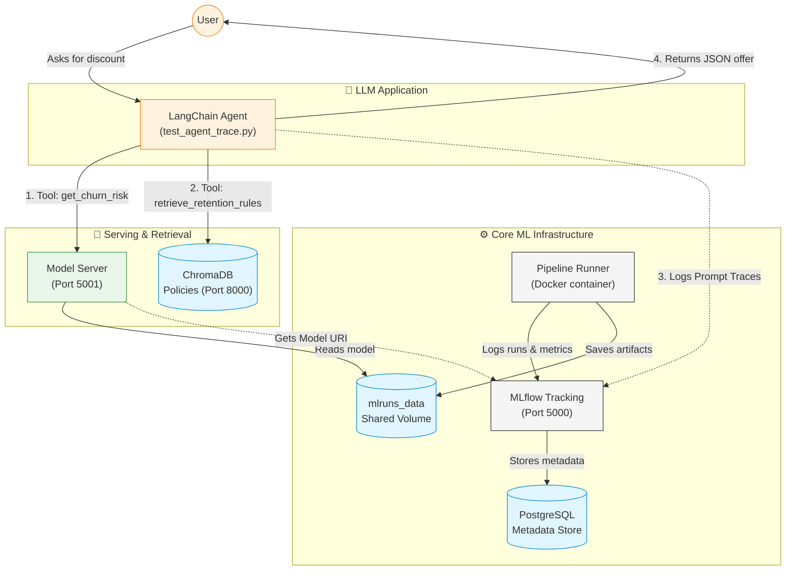

# LLMOps Functional Testing Guide
## How to verify the "Intelligent Retention Assistant"

Before getting started, follow the LOCAL_LLM_GUIDE.md to download the model to be used locally.

Follow these steps to ensure all components of the LLMOps integration (Phase 1-5) are functional.

### 🏗️ Architecture Overview




### 📋 Prerequisites

> [!CAUTION]
> **You MUST create `.env` before running anything.** `mlflow run` injects its own `MLFLOW_TRACKING_URI` (pointing to a local SQLite file) into every subprocess it spawns. Without `.env`, all scripts silently write to that local file instead of the Docker MLflow server — prompts will register "successfully" yet never appear in the UI.
>
> ```bash
> cp .env.example .env    # do this FIRST, before any other command
> ```

- Docker & Docker Compose installed
- MLflow Server reachable at `http://localhost:5000` (started via `docker-compose`)
- **Key `.env` variables:**

  | Variable | Default | Notes |
  |---|---|---|
  | `MLFLOW_TRACKING_URI` | `http://localhost:5000` | Must match your browser's MLflow URL |
  | `LLM_PROVIDER` | `ollama` | `openai` or `ollama` |
  | `LLM_MODEL` | `gemma3:270m` | Model name for the chosen provider |
  | `OPENAI_API_KEY` | _(unset)_ | Required only if `LLM_PROVIDER=openai` |
  | `OLLAMA_BASE_URL` | `http://localhost:11434` | Required only if `LLM_PROVIDER=ollama` |
  | `CHROMA_HOST` | `localhost` | Use `chroma-server` inside Docker network |
| `MODEL_SERVER_URL` | `http://localhost:5001/invocations` | URL for the `model-server` container |

- **Execution**: Always use `uv run mlflow run ... --env-manager local` so your `.env` is loaded.

---

### Phase 1: Infrastructure & Data Setup
**Goal**: Start the stack and index the knowledge base.

1. **Start Services**:
   ```bash
   docker-compose -f docker/compose.yml up -d
   ```
2. **Initialize Search Index (ChromaDB)**:
   ```bash
   make init-search-index
   ```
   *Verification*: Check the logs; you should see `Collection 'retention_policies' initialized with X documents.`

3. **Train & Register Model (MLOps Pipeline)**:
   > [!IMPORTANT]
   > The Agent now calls the `model-server` API. For this to work, you must have a model in the Registry and the server must be running. We run the pipeline inside Docker so artifacts land in the shared `mlruns_data` volume.
   ```bash
   # 1. Run the pipeline inside a container to register the ChurnModel in Production
   make docker-pipeline
   
   # 2. Start the model server
   make model-server-up
   ```
  
---

### Phase 2 & 3: Tracing & Versioning
**Goal**: Register prompts into the MLflow Prompt Registry and verify traces.

1. **Register Prompts**:
   ```bash
   make register-prompts
   ```

   *Verification (UI)*: Open the MLflow UI at `http://localhost:5000`.
   - **MLflow 3.x**: Click the **"Prompts"** tab in the top navigation bar. You should see `retention-assistant-prompt`.

2. **Trigger/Verify Trace**:
   ```bash
   make test-agent
   ```
   *Verification*: In MLflow, check the **Churn_Prediction_Basic** experiment traces.

   Output example:

   ```bash
      Using Local LLM via Ollama: llama3.2:1b
      Starting trace verification for query: 'I am a customer since 3 years (ID: 7590-VHVEG), am I eligible for a discount?'...
      🏃 View run trace_verification_v0.1 at: http://localhost:5000/#/experiments/1/runs/a0e457e12adc4f27a650e8ad50620a35
      🧪 View experiment at: http://localhost:5000/#/experiments/1

      --- AGENT OUTPUT ---
      ### Reasoning:

      Based on the provided CHURN RISK ANALYSIS, we can extract the relevant information as follows:

      * The customer has been a customer for 3 years.
      * The customer's tenure is greater than 24 months.

      Since the customer meets both conditions (tenure > 24 months and contract == 'Two year'), they are eligible for the applicable retention policy: Loyalty Discount with a value of 20% off.

      ### JSON Object:

      ```json
      {
      "customer_id": "7590-VHVEG",
      "risk": {
         "score": 0.50,
         "label": "Low Risk"
      },
      "offer": {
         "name": "Loyalty Discount",
         "value": "20% off",
         "eligibility_rule_id": "RULE_policy_loyalty_discount"
      },
      "justification": "Customer has 3 years tenure, eligible for discount.",
      "sources": ["RULE_policy_loyalty_discount"]
      }
      ```

      ### Example Contract:

      ```json
      {
      "customer_id": "7590-VHVEG",
      "risk": {
         "score": 0.50,
         "label": "Low Risk"
      },
      "offer": {
         "name": "Loyalty Discount",
         "value": "20% off",
         "eligibility_rule_id": "RULE_policy_loyalty_discount"
      },
      "justification": "Customer has 3 years tenure, eligible for discount.",
      "sources": ["RULE_policy_loyalty_discount"]
      }
      ```

      --- TRACE VERIFIED ---
      Check MLflow UI (http://localhost:5000) to confirm spans: get_churn_risk, retrieve_retention_rules, generate.
   ```

---

### Phase 4: Industrial Evaluation
**Goal**: Run the evaluation pipeline and verify gates.

1. **Evaluate Baseline (v1)**:
   > **Note:** Replace `1` with the version ID of your baseline prompt in MLflow.
   ```bash
   make evaluate-agent version=1
   ```
2. **Evaluate Candidate (v2)**:
   > **Note:** Replace `2` with the version ID of your candidate prompt in MLflow.
   ```bash
   make evaluate-agent version=2
   ```
   *Verification*: Console output shows the metrics table and quality gate status:
   - `✅ ALL GATES PASSED` — prompt version is production-safe
   - `❌ GATES FAILED` — prompt version has regressions

---

### Phase 5: Release Decision
**Goal**: Compare runs and get a SHIP/NO_SHIP recommendation.

1. **Run Decision Logic**:
   ```bash
   make release-decision baseline=1 candidate=2
   ```
   *Verification*: The output prints a side-by-side comparison and the final decision:
   - `DECISION: ✅ SHIP` — v2 is better and all gates pass
   - `DECISION: ❌ NO_SHIP` — v2 has regressions or gate failures

---

### 🚨 Troubleshooting

| Symptom | Fix |
|---|---|
| Prompts not visible in UI | Check `MLFLOW_TRACKING_URI=http://localhost:5000` is set in `.env`. The script must connect to the same server as your browser. |
| "Prompt not found" error | Run `register_prompts` at least once. The prompt must be registered before it can be loaded or evaluated. |
| Port conflict on 5000 | Another process is using port 5000. Stop it or change `MLFLOW_TRACKING_URI` to an alternate port. |
| ChromaDB connection error | `CHROMA_HOST=localhost` for local runs; `CHROMA_HOST=chroma-server` when running inside the Docker network. |
| Model Registry error | Run the full MLOps pipeline at least once (`uv run mlflow run . -e workflow --env-manager local`) to register `ChurnModel`. |
